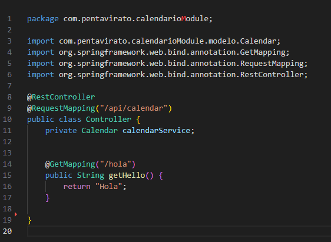
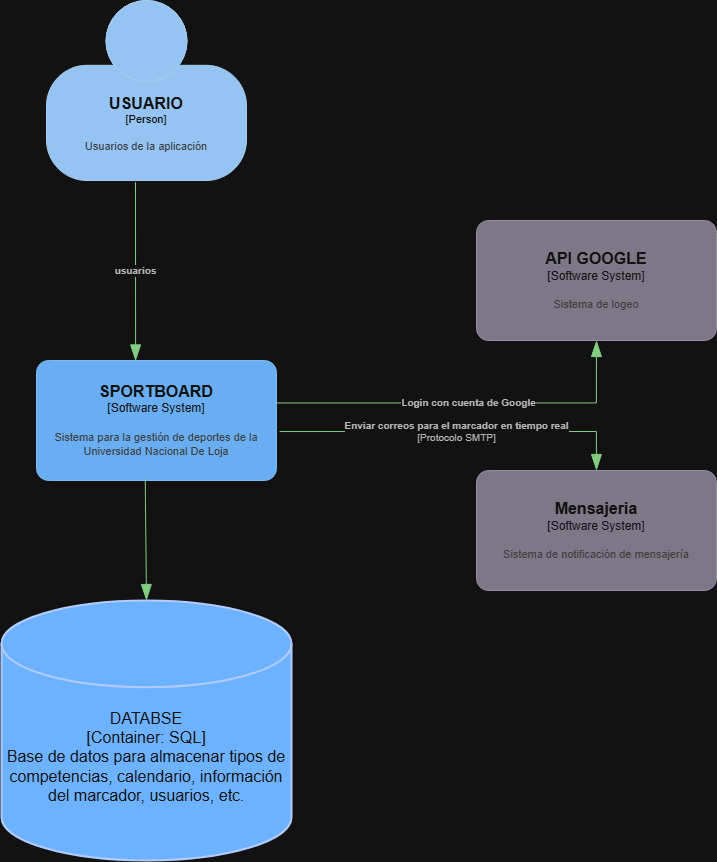
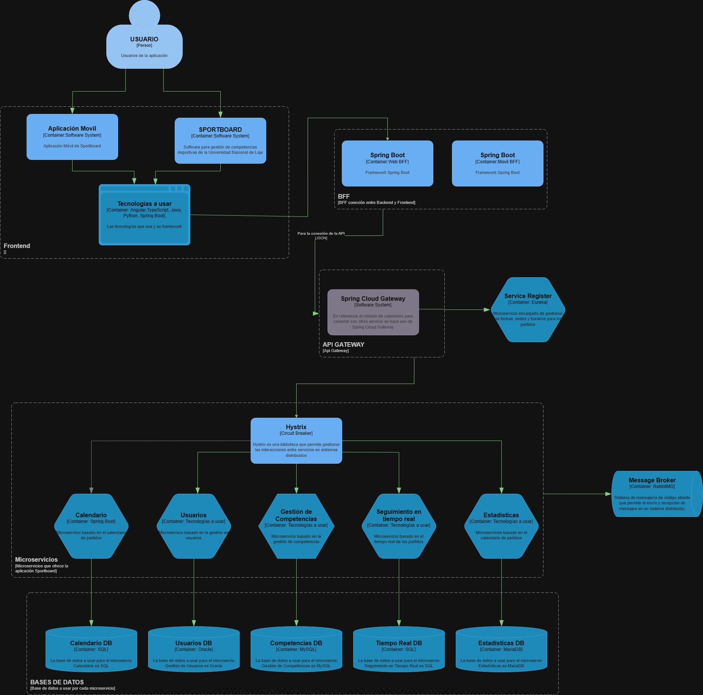
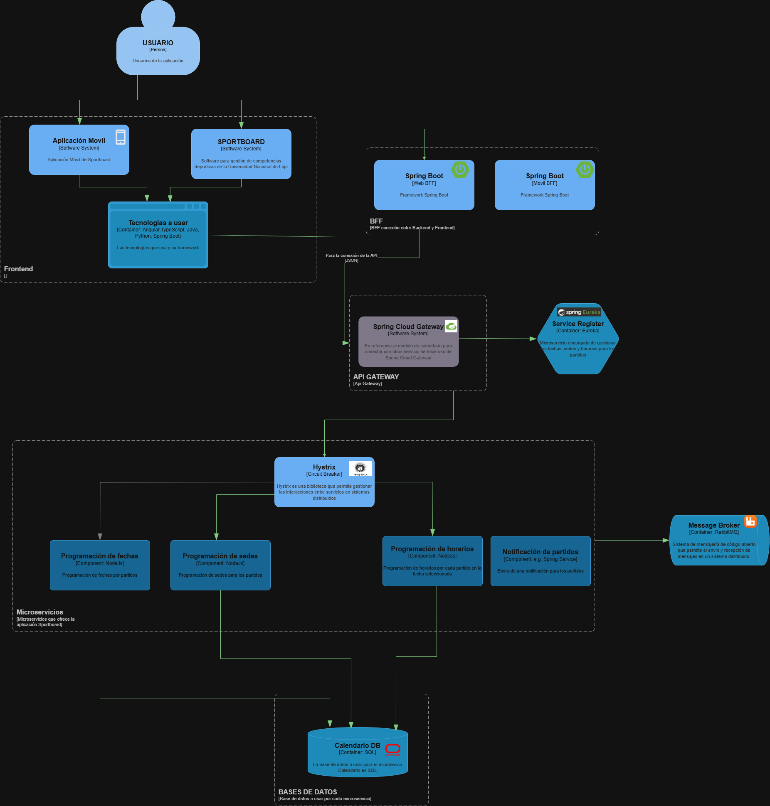

# Descripción del Microservicio

El microservicio **Calendario** es responsable de gestionar los eventos y calendarios deportivos. Proporciona funcionalidades para agregar, editar, y consultar eventos relacionados con las actividades deportivas del sistema.

## Funcionalidades

- **Gestión de eventos:** Permite crear, editar y eliminar eventos deportivos.
- **Consulta de eventos:** Los usuarios pueden consultar eventos por fecha y categoría.
- **Notificaciones:** Envía notificaciones a los usuarios sobre próximos eventos.
- **Integración con otros microservicios:** El microservicio Calendario interactúa con otros servicios como `Usuarios` y `Estadísticas` para obtener información sobre usuarios y estadísticas de eventos.

---

# Endpoints

## Descripción
Un endpoint consiste en una dirección específica dentro de una API, la cual permite acceder a un recurso o la ejecución de una acción en un servidor. En otras palabras, es un punto de contacto entre el cliente y el servidor


## Endpoints 
Los Endpoints utilizados en el proyecto estan relacionados a una API REST para el modulo de Calendario.
A continuación, se presenta los endpoints que permiten realizar las operaciones CRUD (Crear, Leer, Actualizar y Eliminar) sobre eventos o registros en el calendario.

| **Método HTTP** | **Endpoint**             | **Descripción**                                                         |
|-----------------|--------------------------|-------------------------------------------------------------------------|
| `GET`           | `/api/calendario`        | Obtiene todos los eventos del calendario.                               |
| `GET`           | `/api/calendario/{id}`   | Obtiene un evento específico según su ID.                               |
| `POST`          | `/api/calendario`        | Crea un nuevo evento en el calendario.                                  |
| `PUT`           | `/api/calendario/{id}`   | Actualiza un evento existente según su ID.                              |
| `DELETE`        | `/api/calendario/{id}`   | Elimina un evento del calendario según su ID.                           |

## Ejemplo
En el código presente, se define un controlador REST mediante Spring Boot el cual maneja solicitudes HTTP dirigidas a `/api/calendar`. A continuación, se expone un ejemplo de endpoint `GET /api/calendar/hola`, el cual responde con el texto que se define: "Hola"


# Integración de Kong API Gateway con el Microservicio Calendar

## Descripción

Kong es un API Gateway de código abierto que actúa como intermediario para gestionar, enrutando y protegiendo las APIs del sistema. Su integración en este proyecto facilita la gestión de microservicios, como el módulo de Calendario, permitiendo enrutamiento, autenticación, monitoreo y control de acceso centralizado.

En su versión gratuita (Community), Kong no incluye una interfaz gráfica, por lo que se ha utilizado **Konga** como alternativa para gestionar las API y configurar los microservicios de manera eficiente.

## Arquitectura

Se ha utilizado **Docker** y **Docker-Compose** para la implementación de Kong y sus servicios asociados. La configuración de Kong incluye:

1. **Kong Database (MySQL)**: Esta base de datos almacena la configuración y datos relacionados con los microservicios gestionados por Kong.
2. **Kong Migration**: Realiza las migraciones necesarias en la base de datos para inicializarla con los esquemas adecuados.
3. **Kong Gateway**: Actúa como el API Gateway central para enrutar las solicitudes a los microservicios. Se configura con conexión a la base de datos MySQL y otros parámetros relacionados.
4. **Konga**: Es una interfaz gráfica para la administración de Kong, permitiendo gestionar las API y microservicios de manera fácil.

## Docker-Compose

A continuación, se presenta el archivo `docker-compose.yml` que se utiliza para levantar los servicios de Kong, Konga y la base de datos MySQL.

```yaml
version: '3'
services:
  kong-db:
    image: mysql:8.0
    container_name: kong-db
    volumes:
      - db-data-kong-mysql:/var/lib/mysql
    networks:
      - kong-net
    ports:
      - "3306:3306"
    environment:
      MYSQL_ROOT_PASSWORD: pis5
      MYSQL_DATABASE: Sportboard_Calendario
      MYSQL_USER: kong
      MYSQL_PASSWORD: pis5
  
  kong-migration:
    image: kong
    depends_on:
      - kong-db
    container_name: kong-migration
    networks:
      - kong-net
    restart: on-failure
    environment:
      - KONG_DATABASE=mysql
      - KONG_PG_HOST=kong-db
      - KONG_PG_USER=kong
      - KONG_PG_PASSWORD=pis5
      - KONG_PG_DATABASE=Sportboard_Calendario
    command: kong migrations bootstrap
  
  kong:
    image: kong
    container_name: kong
    environment:
      - LC_CTYPE=en_US.UTF-8
      - LC_ALL=en_US.UTF-8
      - KONG_DATABASE=mysql
      - KONG_PG_HOST=kong-db
      - KONG_PG_USER=kong
      - KONG_PG_PASSWORD=pis5
      - KONG_PG_DATABASE=Sportboard_Calendario
      - KONG_CASSANDRA_CONTACT_POINTS=kong-db
      - KONG_PROXY_ACCESS_LOG=/dev/stdout
      - KONG_ADMIN_ACCESS_LOG=/dev/stdout
      - KONG_PROXY_ERROR_LOG=/dev/stderr
      - KONG_ADMIN_ERROR_LOG=/dev/stderr
      - KONG_ADMIN_LISTEN=0.0.0.0:8001, 0.0.0.0:8444 ssl
    restart: on-failure
    ports:
      - 8000:8000
      - 8443:8443
      - 8001:8001
      - 8444:8444
    links:
      - kong-db:kong-db
    networks:
      - kong-net
    depends_on:
      - kong-migration
  
  konga:
    image: pantsel/konga
    ports:
      - 1337:1337
    links:
      - kong:kong
    container_name: konga
    networks:
      - kong-net
    environment:
      - NODE_ENV=production
      - DB_ADAPTER=mysql
      - DB_HOST=kong-db
      - DB_USER=kong
      - DB_PASSWORD=pis5
      - DB_DATABASE=Sportboard_Calendario

volumes:
  db-data-kong-mysql:

networks:
  kong-net:
    external: false

## Docker-File
A continuación, se presenta el archivo `DockerFIle` que se utiliza para construir la imagen del microservicio Calendario.
Este archivo esta diseñado para utilizar Java 17 y ejecutar una aplicación Spring Boot

1. **Usa una imagen base de Java:** 
FROM openjdk:17-jdk-slim

2. **Establece el directorio de trabajo:**
WORKDIR /app

3. **Copia el JAR generado al contenedor:**
COPY target/calendarioModule-0.0.1-SNAPSHOT.jar app.jar

4. **Expone el puerto que usa Spring Boot:**
EXPOSE 9000

5. **Comando para ejecutar la aplicación:**
ENTRYPOINT ["java", "-jar", "app.jar"]


# Modelo C4

## Descripción
El Modelo C4 es una metodología para visualizar la arquitectura de software a diferentes niveles de detalle.
Cada nivel proporciona una visión diferente de la arquitectura, ayudando a los equipos de desarrollo, operaciones 
y otros stakeholders a comprender cómo está estructurado y funciona el sistema.

A continuación, se explicará acerca de los 4 niveles del modelo C4:

### Nivel 1
El diagrama de Contexto es el nivel más alto y proporciona una visión global del sistema en su entorno. Este diagrama se centra en el sistema como un todo y muestra cómo interactúa con usuarios externos, sistemas o servicios. No profundiza en los detalles internos, sino que establece el alcance y las interacciones externas.

A continuación, se muestra la visión general del sistema y las interacciones con actores externos:


### Nivel 2
El diagrama de Contenedores descompone el sistema en contenedores, que representan aplicaciones o servicios ejecutables. Cada contenedor es un proceso que se ejecuta y tiene una funcionalidad propia (por ejemplo, una base de datos, un servicio web o una aplicación móvil).

A continuación, se desglosa el sistema en aplicaciones o servicios que interactúan entre sí:


### Nivel 3
El diagrama de Componentes descompone los contenedores en sus partes más pequeñas y muestra los componentes principales dentro de cada contenedor. Un componente es una unidad funcional del sistema que encapsula una lógica o funcionalidad específica (como un servicio, un módulo o una clase).

A continuación, se muestra cómo esta estructurado un contenedor, desglosando sus principales componentes: 


### Nivel 4
El diagrama de Código es el nivel más bajo de detalle y muestra cómo está implementado un componente a nivel de clases, métodos y relaciones entre estos. Este nivel es útil para los desarrolladores cuando necesitan ver cómo se estructuran los detalles de implementación del código.
