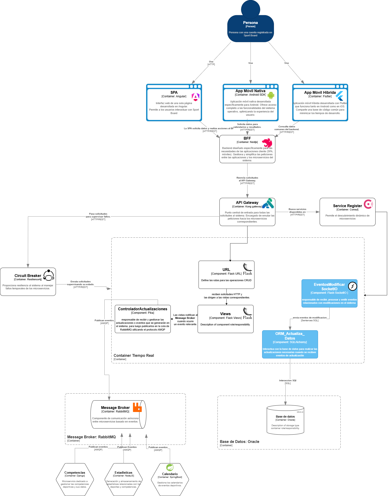
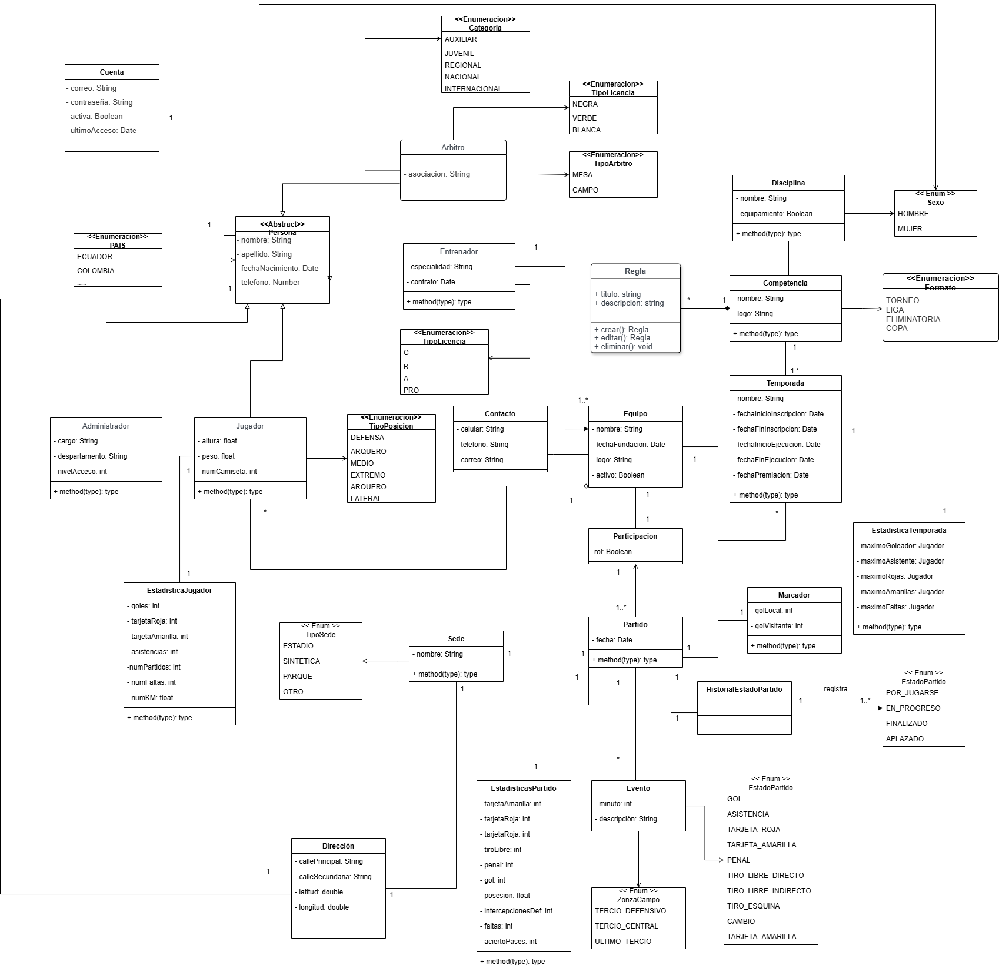

## Descripción
El microservicio de Seguimiento en Tiempo Real forma parte de SportBoard, una plataforma integral de gestión deportiva. Este microservicio permite monitorear eventos deportivos en vivo, proporcionando datos en tiempo real sobre jugadores, partidos y estadísticas clave.

## Funcionalidad
* Panel de control para visualizar el seguimiento en tiempo real de los partidos (goles, faltas, sustituciones, etc.).
* Actualización de estadísticas en tiempo real: posesión de balón, tiros a gol, tarjetas, etc.
* Marcador en vivo.

## Endpoints implementados

| Endpoint           | Path                                  | Ejemplo de Uso                                                       |
|--------------------|---------------------------------------|----------------------------------------------------------------------|
| users-route        | /real-time/users                      | `GET /real-time/users` - Devuelve la lista de todos los usuarios activos. |
| teams-route        | /real-time/teams                      | `GET /real-time/teams` - Muestra todos los equipos registrados.        |
| players-route      | /real-time/players                    | `GET /real-time/players` - Obtiene la lista de jugadores disponibles. |
| coaches-route      | /real-time/coaches                    | `GET /real-time/coaches` - Obtiene información sobre los entrenadores activos. |
| seasons-route      | /real-time/seasons                    | `GET /real-time/seasons` - Devuelve todas las temporadas activas.    |
| competitions-route | /real-time/competitions               | `GET /real-time/competitions` - Muestra todas las competiciones activas. |
| matches-route      | /real-time/matches                    | `GET /real-time/matches` - Obtiene todos los partidos programados.   |
| events-route       | /real-time/events                     | `GET /real-time/events` - Muestra los eventos en tiempo real de todos los partidos. |
| matches-by-day     | /real-time/matches/by-day             | `GET /real-time/matches/by-day?date=2025-02-05` - Lista los partidos para un día específico. |
| matches-filter     | /real-time/matches/filter             | `GET /real-time/matches/filter?team=RealMadrid&competition=LaLiga` - Filtra partidos por equipo y competición. |
| player-match-stats | /real-time/matches/:match_id/player-stats | `GET /real-time/matches/1234/player-stats` - Obtiene las estadísticas de jugadores en un partido específico. |
| player-season-stats| /real-time/player-statistics          | `GET /real-time/player-statistics?player_id=5678` - Muestra las estadísticas de un jugador durante toda la temporada. |
| team-match-stats   | /real-time/matches/:match_id/team-stats | `GET /real-time/matches/1234/team-stats` - Obtiene las estadísticas de un equipo en un partido. |
| team-season-stats  | /real-time/team-statistics            | `GET /real-time/team-statistics?team_id=9876` - Muestra las estadísticas de un equipo durante la temporada. |
| match-events       | /real-time/matches/:match_id/events   | `GET /real-time/matches/1234/events` - Muestra los eventos ocurridos en un partido. |
| team-classification| /real-time/team-statistics/classification | `GET /real-time/team-statistics/classification` - Muestra la clasificación actual de los equipos. |

: {.striped .hover}

## Configuraciones relevantes del contenedor y del API Gateway

### Configuraciones del contenedor

El microservicio tiempo real utiliza un contenedor Docker que incluye una base de datos MariaDB para la persistencia de datos. 

A continuación, se detallan las configuraciones relevantes del contenedor, que incluyen la configuración de la base de datos y el código del backend:

---

- **Servicios**

**`mariadb-real-time`**

**Imagen:**
- `mariadb:10.6`: Se utiliza la versión estable de MariaDB para proporcionar servicios de base de datos.

**Contenedor:**
- `container_name: mariadb-real-time`: Nombre del contenedor de MariaDB en el sistema.

**Variables de Entorno:**
- `MYSQL_ROOT_PASSWORD`: Contraseña para el usuario `root`.
- `MYSQL_DATABASE`: Nombre de la base de datos que se crea al iniciar el contenedor.
- `MYSQL_USER`: Nombre del usuario con privilegios en la base de datos.
- `MYSQL_PASSWORD`: Contraseña para el usuario especificado.

**Puertos:**
- `3306:3306`: El puerto 3306 de MariaDB se mapea al puerto 3306 del host para facilitar la conexión.

**Volúmenes:**
- `mariadb_data:/var/lib/mysql`: Se crea un volumen persistente para almacenar los datos de la base de datos de MariaDB.

**Redes:**
- `sportboard-network`: Se asigna el contenedor a la red `sportboard-network` para la comunicación con otros servicios.

---

**`ms3-real-time`**

**Imagen:**
- Este servicio utiliza una imagen personalizada creada a partir de un Dockerfile ubicado en `../../../docker/backend/ms3-real-time/Dockerfile`.

**Contenedor:**
- `container_name: ms3-real-time`: Nombre del contenedor para el servicio Flask.

**Variables de Entorno:**
- `FLASK_APP`: Define el punto de entrada de la aplicación Flask (archivo `run.py`).
- `FLASK_ENV`: Establece el entorno de Flask, en este caso, `development`.
- `DATABASE_URL`: URL de conexión a la base de datos MariaDB, utilizando el driver `mysql+pymysql`.

**Puertos:**
- `5000:5000`: El puerto 5000 del servicio Flask se mapea al puerto 5000 del host, permitiendo el acceso a la API desde el navegador.

**Dependencias:**
- `depends_on: mariadb-real-time`: Define la dependencia del servicio Flask respecto a MariaDB, asegurando que MariaDB se inicie antes de Flask.

**Volúmenes:**
- `../../../backend/real-time:/source`: Monta el código fuente de la aplicación Flask dentro del contenedor en el directorio `/source`.
- `static_volume:/app/staticfiles`: Se asigna un volumen para almacenar los archivos estáticos generados por Flask.

**Redes:**
- `sportboard-network`: El servicio Flask también se asigna a la misma red `sportboard-network` para permitir la comunicación con MariaDB.

---

**Volúmenes**

**`mariadb_data`**
- Este volumen persiste los datos de la base de datos MariaDB, permitiendo que los datos se conserven incluso si el contenedor se reinicia o detiene.

**`static_volume`**
- Volumen destinado a almacenar los archivos estáticos generados por la aplicación Flask.

---

- **Redes**

**`sportboard-network`**
- Red interna creada para permitir la comunicación entre los contenedores de MariaDB y Flask.

---

**Notas Adicionales**

- **Dependencias**: Aunque se especifica que `ms3-real-time` depende de `mariadb-real-time`, esto no garantiza que MariaDB esté completamente disponible antes de iniciar Flask. Para esto, sería recomendable añadir algún mecanismo de espera o verificación de la disponibilidad de la base de datos.
- **Configuración para producción**: Esta configuración está orientada a un entorno de desarrollo. Para producción, sería recomendable ajustar variables como el puerto, la contraseña y considerar el uso de herramientas de orquestación y seguridad adicionales.

---

### Configuraciones del API Gateway

El API Gateway está configurado para enrutar las solicitudes al microservicio tiempo real.

A continuación, se detallan las configuraciones relevantes del API Gateway, que incluyen la configuración en Docker para integrar Kong al contenedor y la definición de los endpoints de cada módulo en el archivo Kong.yml:

---

- **Servicio PostgreSQL**

**Nombre del servicio:** `postgres`

**Imagen:**
- `postgres:13`: Versión 13 de PostgreSQL.

**Contenedor:**
- `container_name: kong-database`: Nombre del contenedor de PostgreSQL.

**Variables de entorno:**
- `POSTGRES_USER`: `kong` - Usuario de la base de datos.
- `POSTGRES_DB`: `kong` - Nombre de la base de datos.
- `POSTGRES_PASSWORD`: `kong` - Contraseña del usuario.

**Puertos expuestos:**
- `5432:5432` - Mapea el puerto 5432 para acceso a la base de datos.

**Redes:**
- `sportboard-network`: Conexión a la red interna `sportboard-network`.

---

- **Servicio Kong para Migraciones**

**Nombre del servicio:** `kong-migrations`

**Imagen:**
- `kong:3.4`: Utiliza la versión 3.4 de Kong.

**Dependencias:**
- `depends_on: postgres`: Depende del servicio `postgres` para ejecutar las migraciones.

**Variables de entorno:**
- `KONG_DATABASE`: `postgres` - Tipo de base de datos utilizada por Kong.
- `KONG_PG_HOST`: `postgres` - Host de la base de datos.
- `KONG_PG_USER`: `kong` - Usuario de la base de datos.
- `KONG_PG_PASSWORD`: `kong` - Contraseña de la base de datos.

**Comando:**
- `command: kong migrations bootstrap`: Ejecuta las migraciones de la base de datos para preparar Kong.

**Redes:**
- `sportboard-network`: Se conecta a la red `sportboard-network`.

---

- **Servicio Kong (API Gateway)**

**Nombre del servicio:** `kong`

**Imagen:**
- `kong:3.4`: Versión 3.4 de Kong para gestionar el enrutamiento de las solicitudes.

**Contenedor:**
- `container_name: kong`: Nombre del contenedor de Kong.

**Dependencias:**
- `depends_on: kong-migrations`: Depende de que las migraciones de la base de datos hayan sido completadas.

**Variables de entorno:**
- `KONG_DATABASE`: `postgres` - Base de datos utilizada.
- `KONG_PG_HOST`: `postgres` - Host de la base de datos.
- `KONG_PG_USER`: `kong` - Usuario de la base de datos.
- `KONG_PG_PASSWORD`: `kong` - Contraseña de la base de datos.
- `KONG_PROXY_ACCESS_LOG`, `KONG_ADMIN_ACCESS_LOG`: Logs de acceso.
- `KONG_PROXY_ERROR_LOG`, `KONG_ADMIN_ERROR_LOG`: Logs de error.
- `KONG_ADMIN_LISTEN`: `0.0.0.0:8001, 0.0.0.0:8444 ssl` - Puertos para la administración de Kong.
- `KONG_ADMIN_GUI_URL`: `http://localhost:8002` - URL para acceder a la interfaz gráfica de administración de Kong.

**Puertos expuestos:**
- `8000:8000` - Acceso HTTP.
- `8443:8443` - Acceso HTTPS.
- `8001:8001` - Puerto de administración HTTP.
- `8444:8444` - Puerto de administración HTTPS.
- `8002:8002` - Interfaz gráfica de administración.

**Volúmenes:**
- `./kong.yml:/kong.yml`: Importación del archivo de configuración `kong.yml`.

**Comando:**
- `command: kong config db_import /kong.yml && kong start`: Importa la configuración y luego inicia Kong.

**Redes:**
- `sportboard-network`: Se conecta a la red `sportboard-network`.

---

- **Rutas y Servicios Definidos en Kong**

- **`groups-service`**
  - **URL:** `http://catalogs:5241/api/groups`
  - **Rutas:** `/catalog/groups`

- **`catalogs-service`**
  - **URL:** `http://catalogs:5241/api/catalogs`
  - **Rutas:** `/catalog/catalogs`

- **`real-time-service`**
  - **URL:** `http://ms3-real-time:5000/api`
  - **Rutas:**
    - `/real-time/users`
    - `/real-time/teams`
    - `/real-time/players`
    - `/real-time/coaches`
    - `/real-time/seasons`
    - `/real-time/competitions`
    - `/real-time/matches`
    - `/real-time/events`
    - `/real-time/matches/by-day`
    - `/real-time/matches/filter`
    - `/real-time/matches/:match_id/player-stats`
    - `/real-time/player-statistics`
    - `/real-time/matches/:match_id/team-stats`
    - `/real-time/team-statistics`
    - `/real-time/matches/:match_id/events`
    - `/real-time/team-statistics/classification`

- **`ms2-competencies`**
  - **URL:** `http://ms2-competencies:8003`
  - **Rutas:**
    - `/api`
    - `/static/`
    - `/media/`

---

- **Red de Contenedores**

**`sportboard-network`**
- Red interna que conecta todos los servicios (PostgreSQL, Kong y los microservicios).

---

## Modelo C4
* Nivel 3 - Componentes
{target="_blank"}

* Nivel 4 - Código
{target="_blank"}